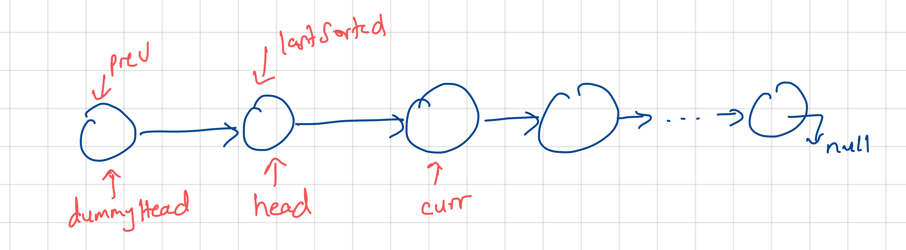

# Comprehensive Algorithms and Data Structures.

This repository houses my solutions and detailed explanations to popular algorithms and data structures problems. The solutions are provided in `JavaScript` / `TypeScript`, `Python`, `C` and `Java` which are languages that I am more comfortable with. The repo is intended to be my online reference or notes as I learn these topics and I hope you find this information valuable. Feel free to fork, clone or build on it.

*Each algorithm and data structure has its own separate directory containing its implemetation and problem solutions in the various languages*


```sh
├── README.md
├── Algorithms
├────  binary-search/
│       ├── JavaScript/
│       ├── .../
│       ├── Python
├────  sorting-algorithms/
│       ├── ...
├── Data Structures
├────  linked-lists/
│       ├── JavaScript/
│       ├── ...
├── Leetcode
├────  1-two-sum/
│       ├── ...
```

## Table of Contents
- [Algorithms](#algorithms)
  - [Sorting algorithms](#sorting-algorithms)
    - [Insertion Sort](#insertion-sort)
  - [Binary Search](#binary-search)
- [Data Structures](#data-structures)
  - [Linked Lists](#linked-lists)

  ---

# Algorithms

## Sorting algorithms

### Insertion Sort

Insertion sort builds the final sorted array, one element at a time by shifting elements to the right until the correct position in the sorted portion of the array is found. An intuitive way that I have seen it being described is it is like sorting a hand of playing cards - take a card, find its correct place within sorted cards, and insert it at that location.

**Algorithm**

Initialization
- Assuming we have an unsorted array of numbers: `[9,3,5,1,7,2,8,4]`
- We take the first element and consider it as the sorted portion of the array. `[9]`

Iteration
- Iterate over the remaining elements in the array starting from the second element `i=1`
- In each iteration, compare the current element with the sorted portion of the array, moving elements to the right until we find the correct position to insert the current element `array[i]`

Insertion
- For our example, consider the first element outside the sorted portion, `array[i]=3`
- Compare `3` with the elements in the sorted portion `[9]`
- `3` is smaller than `9` so move `9` one position to the right resulting in `[3,9]` as the current sorted portion of the array

Repeat until the array is sorted
- continue for all the remaining unsorted elements, comparing and shifting as necessary
- Once we reach the end of the array, it will be fully sorted

**Implementation**

`Javascript`

```js
function insertionSort(array) {
  for (let i = 1; i < array.length; i++) {
    const currVal = array[i];

    let j = i - 1;
    while (j >= 0 && array[j] > currVal) {
      array[j + 1] = array[j];
      j -= 1;
    }

    array[j + 1] = currVal;
  }
  return array;
}

const arr = [9, 3, 5, 1, 7, 2, 8, 4];

// [ 1, 2, 3, 4, 5, 7, 8, 9]
console.log(insertionSort(arr));
```

Other implementations: [`Python`](https://github.com/mathewbushuru/algorithms/blob/main/algorithms/sorting-algorithms/insertion-sort/python/insertion_sort.py), [`Java`](https://github.com/mathewbushuru/algorithms/blob/main/algorithms/sorting-algorithms/insertion-sort/java/insertionSort.java), [`C`](https://github.com/mathewbushuru/algorithms/blob/main/algorithms/sorting-algorithms/insertion-sort/c/insertion_sort.c), [`TypeScript`](https://github.com/mathewbushuru/algorithms/blob/main/algorithms/sorting-algorithms/insertion-sort/typescript/insertionSort.ts)

Time Complexity:
- Best case: O(n)
- Average and Worst case:  (O(n^2))

Space Complexity: O(1)

**Leetcode 147 (Medium) - [Insertion Sort List](https://leetcode.com/problems/insertion-sort-list/)**
> Given the `head` of a singly-linked linked list, sort the list using insertion sort, and return the sorted list's head.

> The steps of the insertion sort algorithm:
Insertion sort iterates, consuming one element each repetition and growing a sorted output list. At each iteration, insertion sort removes one element from the input data, finds the location it belongs in the input data and inserts it there.
It repeats until no input elements remain.

>Input: `head = [4,2,1,3]`
Output: `[1,2,3,4]`

>Input: `head = [-1,5,3,4,0]`
Output: `[-1,0,3,4,5]`

Solution



`JavaScript`

```js
// provided in problem
function ListNode(val, next) {
  this.val = val === undefined ? 0 : val;
  this.next = next === undefined ? null : next;
}

const insertionSortList = function (head) {
  // special case
  if (head === null) {
    return null;
  }

  // start of sorted list
  let dummyHead = new ListNode(0);
  dummyHead.next = head;

  // last node in sorted portion of list
  let lastSorted = head;

  // node to be inserted in iteration
  let curr = head.next;

  while (curr !== null) {
    if (lastSorted.val <= curr.val) {
      // curr in correct position already so just move pointer
      lastSorted = lastSorted.next;
    } else {
      // find correct position to insert curr
      let prev = dummyHead.next;

      while (prev.next.val <= curr.val) {
        prev = prev.next;
      }

      // insert curr just where prev stopped
      lastSorted.next = curr.next;
      curr.next = prev.next;
      prev.next = curr;
    }

    curr = lastSorted.next;
  }

  return dummyHead.next;
};
```

Other solutions: [`Python`](https://github.com/mathewbushuru/algorithms/blob/main/leetcode/147-insertion-sort-list-M/python/insertion_sort_list.py),  [`C`](https://github.com/mathewbushuru/algorithms/blob/main/leetcode/147-insertion-sort-list-M/c/insertionSortList.c), [`Java`](https://github.com/mathewbushuru/algorithms/blob/main/leetcode/147-insertion-sort-list-M/java/Solution.java)

Time complexity: O(n^2)

Space complexity: O(1)

---

## Data Structures

---
