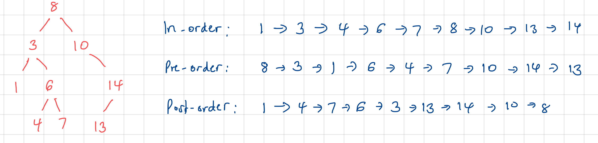
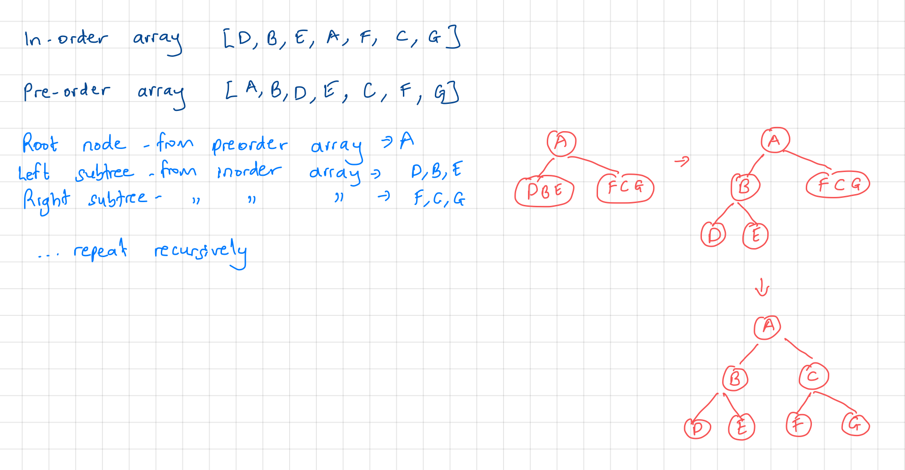

# Comprehensive Algorithms and Data Structures.

This repository houses my solutions and detailed explanations to popular algorithms and data structures problems. The solutions are provided in `JavaScript`, `Java`, `TypeScript`, `Python` and `C`. This repository is intended to be my online reference / notes as I learn these topics and I hope you find this information valuable.

Each algorithm and data structure has its own separate directory containing its implemetation and problem solutions in the various languages.

```sh
├── README.md
├── Concepts
├────  big-o/
├────  ...
├── Algorithms
├────  sorting-algorithms/
├───────  insertion-sort/
│          ├── JavaScript/
│          ├── .../
├────  search-algorithms/
├───────  binary-search/
│          ├── JavaScript/
│          ├── .../
├── Data Structures
├────  trees/
├───────  binary-trees/
│          ├── JavaScript/
│          ├── ...
├── Leetcode
├────  1-two-sum/
│        ├── ...
```

## Table of Contents

- [Concepts](#concepts)
  - [Big O](#big-o)
- [Algorithms](#algorithms)
  - [Sorting Algorithms](#sorting-algorithms)
    - [Insertion Sort](#insertion-sort)
  - [Search Algorithms](#search-algorithms)
    - [Binary Search](#binary-search)
- [Data Structures](#data-structures)

  - [Arrays and Strings](#arrays-and-strings)
  - [Trees](#trees)
    - [Binary Trees](#binary-trees)
    - [Binary Search Trees](#binary-search-trees)

  ***

# Concepts

## Big O

Big O notation describes the upper bound of an algorithm in the worst case scenario, meaning how the runtime or space requirements grow as the input size grows. It gives us an idea on the efficiency of an algorithm, particularly in the context of scalability.

Below are some common Big-O complexities, from fastest to slowest:

- **O(1), constant time**: Algorithm takes constant amount of time, regardless of input size.
- **O(log(n)), logarithmic time**: Common in algorithms that decrease the input size with each iteration, e.g binary search.
- **O(n)), linear time**: Runtime grows linearly with input size, e.g simple search algorithms
- **O(nlog(n))), loglinear time**: The running time increases linearly with input size, but it incorporates a logarithmic growth factor e.g merge sort
- **O(n^2), O(n^3), polynomial time**: Often seen in nested loops e.g bubble sort
- **O(2^n), exponential time**: The running time doubles for each additional element in the input. It is typically in recursive processes where each step generates multiple additional recursive steps e.g the recursive implementation of Fibonacci numbers.
- **O(n!), factorial time**: Very slow algorithms typically in problems requiring permutations or combinations, eg solving the traveling salesman problem by brute force.

Big O is also used to represent how the amount of memory used by an algorithm grows with input size. We ignore the constant coeffiecients and smaller terms in Big O.

**O(1) Constant time example - accessing element from array**

`JavaScript`

```js
function getArrayElement(arr, index) {
  return arr[index];
}

const arr1 = [1, 2, 3, 4, 5];
// 3
console.log(getArrayElement(arr1, 2));
```

Other languages: [`Java`](https://github.com/mathewbushuru/algorithms/blob/main/concepts/big-o/constant-time-example/java/ConstantTimeExample.java)

**O(log(n)) logarithmic time example - fast power algorithm**

Fast power algorithm calculates the power of a number in logarithmic time using the 'exponentiation by squaring' method.

If we want to compute a^n:

- if n is even, then a^n = (a^(n/2))^2
- if n is odd, then a^n = a x a^(n-1)

`JavaScript`

```js
function fastPower(base, exponent) {
  if (exponent === 0) {
    return 1;
  }

  const halfPower = fastPower(base, Math.floor(exponent / 2));

  if (exponent % 2 === 0) {
    return halfPower * halfPower;
  } else {
    return base * halfPower * halfPower;
  }
}

// 1024
console.log(fastPower(2, 10));
```

Other languages: [`Java`](https://github.com/mathewbushuru/algorithms/blob/main/concepts/big-o/logarithmic-time-example/java/FastPowerExample.java)

**O(n) Linear time example - max element in unsorted list**

`JavaScript`

```js
function findMax(arr) {
  let maxVal = arr[0];

  for (let i = 1; i < arr.length; i++) {
    if (arr[i] > maxVal) {
      maxVal = arr[i];
    }
  }

  return maxVal;
}

const sampleArray = [3, 1, 4, 5, 9, 2, 6, 5];
// 9
console.log(findMax(sampleArray));
```

Other languages: [`Java`](https://github.com/mathewbushuru/algorithms/blob/main/concepts/big-o/linear-time-example/java/LinearTimeExample.java)

**O(nlog(n)) LogLinear time example - merge sort**

For each increase in input size, the time it takes to complete the task grows in a way that's proportional to both the size of the input and the logarithm of that size. The logarithmic component typically comes from dividing the problem into smaller parts (divide and conquer), and the linear component is from processing each part.

`JavaScript`

```js
function mergeSort(arr) {
  // base case
  if (arr.length < 2) {
    return arr;
  }

  // divide array into two
  const leftArr = arr.slice(0, arr.length / 2);
  const rightArr = arr.slice(arr.length / 2);

  // sort each half array
  const sortedLeft = mergeSort(leftArr);
  const sortedRight = mergeSort(rightArr);

  // merge sorted left and right arrays
  const sortedArr = mergeSortedArrays(sortedLeft, sortedRight);

  return sortedArr;
}

function mergeSortedArrays(arr1, arr2) {
  let i = 0;
  let j = 0;
  const sortedArr = [];

  while (i < arr1.length && j < arr2.length) {
    if (arr1[i] < arr2[j]) {
      sortedArr.push(arr1[i]);
      i += 1;
    } else {
      sortedArr.push(arr2[j]);
      j += 1;
    }
  }

  while (i < arr1.length) {
    sortedArr.push(arr1[i]);
    i += 1;
  }

  while (j < arr2.length) {
    sortedArr.push(arr2[j]);
    j += 1;
  }

  return sortedArr;
}

const arr = [2, 4, 9, 6, 1, 8, 3, 5, 7];
// [ 1, 2, 3, 4, 5, 6, 7, 8, 9]
console.log(mergeSort(arr));
```

**O(n^3) Polynomial time example - 3 Sum problem naive solution**

For the three sum problem, we are given an array of n numbers, and we determine if there exists three elements a, b and c in the array such that a + b + c = 0;

`JavaScript`

```js
function threeSumZero(arr) {
  let n = arr.length;

  for (let i = 0; i < n - 2; i++) {
    for (let j = i + 1; j < n - 1; j++) {
      for (let k = j + 1; k < n; k++) {
        if (arr[i] + arr[j] + arr[k] === 0) {
          return [arr[i], arr[j], arr[k]];
        }
      }
    }
  }

  return null;
}

const sampleArray = [-1, 0, 1, 2, -1, -4];
// [-1, 0, 1]
console.log(threeSumZero(sampleArray));
```

Note that we can get more efficient implementations to the three sum example. In the example below, we use the two-pointer technique to reduce the runtime to O(n^2). The idea is to sort the array first, and then for each element, use two pairs to find the pair that sums up to negate that element.

```js
function threeSumZeroBetter(arr) {
  // eg arr = [-1, 0, 1, 2, -1, -4]

  // sort the array, O(nlogn)
  // arr now [-4, -1, -1, 0, 1, 2]
  arr.sort((a, b) => a - b);

  for (let i = 0; i < arr.length - 2; i++) {
    if (i > 0 && arr[i] === arr[i - 1]) {
      // skip duplicates
      continue;
    }

    let left = i + 1;
    let right = arr.length - 1;

    while (left < right) {
      const sum = arr[i] + arr[left] + arr[right];

      if (sum === 0) {
        return [arr[i], arr[left], arr[right]];
      } else if (sum < 0) {
        left++;
      } else {
        right--;
      }
    }
  }

  // no triplet found
  return null;
}

// [ -1, -1, 2 ]
console.log(threeSumZeroBetter(sampleArray));
```

**O(2^n) Exponential time example - compute n^th Fibonacci number**

They arise when we have multiple recursion calls for each step of the algorithm.

`JavaScript`

```js
function fibonacci(n) {
  if (n <= 1) {
    return n;
  }

  return fibonacci(n - 1) + fibonacci(n - 2);
}

// 55
console.log(fibonacci(10));
```

Other languages: [`Java`](https://github.com/mathewbushuru/algorithms/blob/main/concepts/big-o/exponential-time-example/java/ExponentialTimeExample.java)

Note that this native recursive implementation is very inefficient especially for large values of n. We can use the concept of dynamic programming and memoization to greatly reduce the time complexity by storing previously computed results and avoiding redundant calculations. The optimization below reduces the runtime to O(n).

```js
function fibonacciBetter(n, memo = []) {
  if (memo[n] !== undefined) return memo[n];

  if (n <= 1) return n;

  memo[n] = fibonacci(n - 1, memo) + fibonacci(n - 2, memo);
  return memo[n];
}

// 55
console.log(fibonacciBetter(10));
```

A way to generalize the runtimes of recursive functions is often O(branches^depth), where branches is the number of times each recursive call branches e.g 2 for fibonacci.

<!-- **O(n!) Factorial time example - Travelling Salesman Problem**

The  "Travelling Salesman Problem"(TSP) can be naively(brute-force) solved using a factorial-time complexity algorithm. TSP is stated as: Given a list of cities and distances between each pair of cities, find the shortest possible route that visits each city once and returns to the origin city.

The brute-force approach is to generate all possible permutations of cities and calculate the total distance for each permutation. -->

# Algorithms

## Sorting algorithms

### Insertion Sort

Insertion sort builds the final sorted array, one element at a time by shifting elements to the right until the correct position in the sorted portion of the array is found. An intuitive way that I have seen it being described is it is like sorting a hand of playing cards - take a card, find its correct place within sorted cards, and insert it at that location.

**Algorithm**

Initialization

- Assuming we have an unsorted array of numbers: `[9,3,5,1,7,2,8,4]`
- We take the first element and consider it as the sorted portion of the array. `[9]`

Iteration

- Iterate over the remaining elements in the array starting from the second element `i=1`
- In each iteration, compare the current element with the sorted portion of the array, moving elements to the right until we find the correct position to insert the current element `array[i]`

Insertion

- For our example, consider the first element outside the sorted portion, `array[i]=3`
- Compare `3` with the elements in the sorted portion `[9]`
- `3` is smaller than `9` so move `9` one position to the right resulting in `[3,9]` as the current sorted portion of the array

Repeat until the array is sorted

- continue for all the remaining unsorted elements, comparing and shifting as necessary
- Once we reach the end of the array, it will be fully sorted

**Implementation**

`JavaScript`

```js
function insertionSort(array) {
  for (let i = 1; i < array.length; i++) {
    const currVal = array[i];

    let j = i - 1;
    while (j >= 0 && array[j] > currVal) {
      array[j + 1] = array[j];
      j -= 1;
    }

    array[j + 1] = currVal;
  }
  return array;
}

const arr = [9, 3, 5, 1, 7, 2, 8, 4];

// [ 1, 2, 3, 4, 5, 7, 8, 9]
console.log(insertionSort(arr));
```

Other implementations: [`Java`](https://github.com/mathewbushuru/algorithms/blob/main/algorithms/sorting-algorithms/insertion-sort/java/insertionSort.java), [`Python`](https://github.com/mathewbushuru/algorithms/blob/main/algorithms/sorting-algorithms/insertion-sort/python/insertion_sort.py), [`C`](https://github.com/mathewbushuru/algorithms/blob/main/algorithms/sorting-algorithms/insertion-sort/c/insertion_sort.c), [`TypeScript`](https://github.com/mathewbushuru/algorithms/blob/main/algorithms/sorting-algorithms/insertion-sort/typescript/insertionSort.ts)

Time Complexity:

- Best case: `O(n)`
- Average and Worst case: `(O(n^2))`

Space Complexity: O(1)

**Solved leetcode examples**

- 147 (Medium) - [Insertion Sort List](https://github.com/mathewbushuru/algorithms/tree/main/leetcode/147-insertion-sort-list-M)
- 57 (Medium) - [Insert Interval](https://github.com/mathewbushuru/algorithms/tree/main/leetcode/57-insert-interval)

## Search Algorithms

### Binary Search

Binary search is a divide and conquer algorithm used to efficiently search for a specific element in a sorted array. It works by repeatedly dividing the search space in half, eliminating the half that cannot contain the target element.

**Implementation**

`JavaScript`

```js
function binarySearch(array, target) {
  // lowest index of search space
  let low = 0;
  // highest index of search space
  let high = array.length - 1;

  while (low <= high) {
    // find the middle index
    let mid = Math.floor((low + high) / 2);

    if (array[mid] === target) {
      // target element found at middle index
      return mid;
    } else if (array[mid] < target) {
      // update lower bound to search in right half
      low = mid + 1;
    } else {
      // update upper bound to search in lower half
      high = mid - 1;
    }
  }

  // if we reach here, target was not found
  return -1;
}
```

Other implementations: [`Java`](https://github.com/mathewbushuru/algorithms/blob/main/algorithms/search-algorithms/binary-search/java/BinarySearch.java) ,[`C`](https://github.com/mathewbushuru/algorithms/blob/main/algorithms/search-algorithms/binary-search/c/binarySearch.c), [`Python`](https://github.com/mathewbushuru/algorithms/blob/main/algorithms/search-algorithms/binary-search/python/binarySearch.py), [`TypeScript`](https://github.com/mathewbushuru/algorithms/blob/main/algorithms/search-algorithms/binary-search/typescript/binarySearch.ts)

Time complexity: `O(log(n))`

Space complexity: `O(1)`

We can also use recursion to implement binary search but it has a worse space complexity.

```js
function binarySearchRecursive(array, target) {
  return binarySearchRecursiveHelper(array, target, 0, array.length - 1);
}

function binarySearchRecursiveHelper(array, target, low, high) {
  if (low > high) {
    // target element not found
    return -1;
  }

  // find middle index
  let mid = Math.floor((low + high) / 2);

  if (array[mid] === target) {
    // target element found at middle index
    return mid;
  } else if (array[mid] < target) {
    // search in right half
    return binarySearchRecursiveHelper(array, target, mid + 1, high);
  } else {
    // search in left half
    return binarySearchRecursiveHelper(array, target, low, mid - 1);
  }
}

const arr = [1, 2, 3, 4, 5, 6, 7, 8];

// 5
console.log(binarySearchRecursive(arr, 6));
```

Time complexity: `O(log(n))`

Space complexity: `O(log(n))`. Each recursive call adds a new frame to the call stack containing the local variables and parameters of each function call. The depth of the recursive calls corresponds to the number of times the search space is halved until the base case is reached.

**Solved LeetCode examples**

- 34 (Medium) - [Find First and Last Position of Element in Sorted Array](https://github.com/mathewbushuru/algorithms/tree/main/leetcode/34-fist-and-last-position-of-element-in-sorted-array-M)
- 69 (Easy) - [Sqrt(x)](https://github.com/mathewbushuru/algorithms/tree/main/leetcode/69-sqrt(x))
- 153 (Medium) - [Find Minimum in Rotated Sorted Array](https://github.com/mathewbushuru/algorithms/tree/main/leetcode/153-minimum-in-rotated-sorted-array)
- 704 (Easy) - [Binary Search](https://github.com/mathewbushuru/algorithms/tree/main/leetcode/704-binary-search)
- 875 (Medium) - [Koko Eating Bananas](https://github.com/mathewbushuru/algorithms/tree/main/leetcode/875-koko-eating-bananas)

---

# Data Structures

## Arrays and Strings

I am putting arrays and strings together since their problems are often interchangeable.

**Array operations**

`JavaScript`

```js
/**
 * Declaration
 */
const arr = []; // empty array
const arrWithValues = [1, 2, 3, 4, 5]; // Array  with values
const arrWithSize = new Array(5); // Array with size

/**
 * Accessing elements
 */
let firstElement = arrWithValues[0]; // 1

/**
 * Setting elements
 */
arrWithValues[0] = 100;

/**
 * Array length
 */
const length = arrWithValues.length;

/**
 * Iterating over arrays
 */
for (let value of arrWithValues) {
  console.log(value);
}
for (let i = 0; i < arrWithValues.length; i++) {
  console.log(arrWithValues[i]);
}

/**
 * Multi-dimensional arrays
 */
const multiArray = [
  [1, 2, 3],
  [4, 5, 6],
  [7, 8, 9],
];
console.log(multiArray[1][2]); // 6

/**
 * Common methods
 */
// add to end
arrWithValues.push(200);

// remove from end
arrWithValues.pop();

// add to beginning
arrWithValues.unshift(10);

// remove from beginning
let firstItem = arrWithValues.shift();

// slice array - creates new array object not including end
let start = 0;
let end = 3;
const newArr = arrWithValues.slice(start, end);

// splice array - add, remove or replace existing elements in place
const months = ["Jan", "Mar", "Apr", "Jun"];
let startIndex = 1;
let numOfElementsToRemove = 0;
months.splice(startIndex, numOfElementsToRemove, "Feb");
```

Other languages: [`Java - Arrays`](https://github.com/mathewbushuru/algorithms/blob/main/data-structures/arrays/java/ArrayOperations.java), [`Java - ArrayLists`](https://github.com/mathewbushuru/algorithms/blob/main/data-structures/arrays/java/ArrayListOperations.java)

**String operations**

`JavaScript`

```js
/**
 * declaration / initialization
 */
let str1 = "This is a string";
let str2 = 'This is also a string';
let str3 = `Template literal string, ${str1}`;

/**
 * accessing characters
 */
let char = str1[5];

/**
 * string length
 */
let len = str1.length;

/**
 * finding a substring
 */
// first occurrence (-1 if not found) - 17
let position = str3.indexOf("string");
// last occurrence - 35
let lastPosition = str3.lastIndexOf("string");
// checking substring existence - true
let exists = str1.includes("string");

/**
 * substring, slice
 */
// substring(start, end);
// extract characters from start to (end - 1) - 'is a s'
let sub = str1.substring(5, 11);
// slice(start, end);
// similar to substring but can accept negative indices - 'is a strin'
let sub2 = str1.slice(5, -1);

/**
 * string manipulation
 */
// concatenation
let concatedStr = str1 + " " + str2;
let concatedStr2 = str1.concat(str2);
// template literals
let name = "Matt";
let greeting = `Hello ${name}!`;
// changing case
let upper = str1.toUpperCase();
let lower = str1.toLowerCase();
// trimming spaces at start and end - 'extra spaces'
let trimmed = "    extra spaces     ".trim();

/**
 * splitting and joining
 */
// split(delimiter); - string into an array
let words = str1.split(" ");
// join(delimiter); - array into string
let sentence = words.join(" ");

/**
 * replacing text
 */
let replaced = str1.replace("string", "replacedString");
```

JavaScript strings are immutable so methods that seem to modify strings like `replace` or `toUpperCase` actually return new strings.

Other languages: [`Java `](https://github.com/mathewbushuru/algorithms/blob/main/data-structures/strings/java/StringOperations.java)

## Trees

A tree is a hierarchical data structure that represents a collection of elements called nodes. The nodes are connected by edges to form a tree-like structure. They enable efficient organization and retrieval of data.

The root is a special node that serves as the top-most node in a hierarchy. Each node in the tree, except for the root, has exactly one parent node and zero or more child nodes. Nodes directly connected to a particular node are called its children, and the node that connects to its children is called the parent.

### Binary Trees

This is a tree in which each node has at most two children, referred to as the left child and the right child. Each child node is either a leaf node (having no children) or an internal node (having one or more children).

A complete binary tree is one in which each level of the tree is completely filled except the last level, and all nodes appear as far left as possible . A full/extended binary tree is one where no node has only one child - each node has either zero or two children. A perfect binary tree is both full and complete.

Binary tree traversal is the process of visiting each node in the tree exactly once. Three common methods of traversing binary trees are in-order traversal, pre-order traversal, and post-order traversal.

- In-order: Nodes are visited in the order 'left subtree' - 'parent node' - 'right subtree'. The left node is visited first, followed by the parent node, then the right child. This is used in binary search trees because it visits the nodes in ascending order if the tree is structured properly.
- Pre-order: Nodes are visited in the order 'parent node' - 'left subtree' - 'right subtree'. The parent node is visited before its children. It is useful for creating a copy of the tree, as the order of visiting the nodes allows for easy replication of the structure.
- Post-order: Nodes are visited in the order 'left subtree' - 'right subtree' - 'parent node'. The children are visited before the parent node. This is used in deleting nodes as it ensures the node is only deleted after its children have been deleted.



Note that trees can also be traversed in level-order (breadth-first algorithm.)

We can reconstruct a binary tree if given at least two traversal results. First traversal must be the in-order result, and the second can be either pre-order or post-order traversal. The in-order traversal helps us identify left and right child nodes, and the pre/post-order determines the root node. First element in pre-order traversal is the root node, while the last in post-order is the root node.

For example, if we are given two arrays with the preorder and inorder traversal results, we use the preorder array to find the root node (first element in array). We then locate the index of this root node in the inorder traversal array. Elements to the left of the root in the inorder array are from the left subtree. Similarly, those to the right of the root node form the right subtree. We recursively select elements from the preorder array and create its left and right subtrees from the inorder array.



**Implementation**

`JavaScript`

```js
class Node {
  constructor(value) {
    this.value = value;
    this.left = null;
    this.right = null;
  }
}

class BinaryTree {
  constructor() {
    this.root = null;
  }

  insert(value) {
    const newNode = new Node(value);

    if (this.root === null) {
      this.root = newNode;
    } else {
      this.insertNode(this.root, newNode);
    }
  }

  insertNode(node, newNode) {
    if (newNode.value < node.value) {
      // if tree required to be a binary search tree, then smaller values to left subtree
      if (node.left === null) {
        node.left = newNode;
      } else {
        this.insertNode(node.left, newNode);
      }
    } else {
      // newNode is larger, insert in right subtree
      if (node.right === null) {
        node.right = newNode;
      } else {
        this.insertNode(node.right, newNode);
      }
    }
  }

  delete(value) {
    this.root = this.deleteNode(this.root, value);
  }

  deleteNode(node, value) {
    if (node === null) {
      return null;
    }

    if (value < node.value) {
      node.left = this.deleteNode(node.left, value);
    } else if (value > node.value) {
      node.right = this.deleteNode(node.right, value);
    } else {
      // delete current node
      if (node.left === null && node.right === null) {
        // has no children
        node = null;
      } else if (node.left === null) {
        //has one right child
        node = node.right;
      } else if (node.right === null) {
        // has one left child
        node = node.left;
      } else {
        // has two children
        const minRight = this.findMinNode(node.right);
        // minRight is larger than all left subtree values
        // and ofc smaller than all right subtree values
        // alternative would be to use max value in left subtree
        node.value = minRight.value;
        node.right = this.deleteNode(node.right, minRight.value);
      }
    }
    return node;
  }

  findMinNode(node) {
    if (node.left === null) {
      // nothing in left subtree, so parent is automatically the min
      return node;
    } else {
      return this.findMinNode(node.left);
    }
  }

  inOrderTraversal(callbackFn) {
    this.inOrderTraversalNode(this.root, callbackFn);
  }

  inOrderTraversalNode(node, callbackFn) {
    if (node !== null) {
      this.inOrderTraversalNode(node.left, callbackFn);
      callbackFn(node.value);
      this.inOrderTraversalNode(node.right, callbackFn);
    }
  }

  preOrderTraversal(callbackFn) {
    this.preOrderTraversalNode(this.root, callbackFn);
  }

  preOrderTraversalNode(node, callbackFn) {
    if (node !== null) {
      callbackFn(node.value);
      this.preOrderTraversalNode(node.left, callbackFn);
      this.preOrderTraversalNode(node.right, callbackFn);
    }
  }

  postOrderTraversal(callbackFn) {
    this.postOrderTraversalNode(this.root, callbackFn);
  }

  postOrderTraversalNode(node, callbackFn) {
    if (node !== null) {
      this.postOrderTraversalNode(node.left, callbackFn);
      this.postOrderTraversalNode(node.right, callbackFn);
      callbackFn(node.value);
    }
  }
}
```

An example binary tree (BST) is shown below


```js
const binaryTree = new BinaryTree();

binaryTree.insert(8);
binaryTree.insert(3);
binaryTree.insert(10);
binaryTree.insert(1);
binaryTree.insert(6);
binaryTree.insert(14);
binaryTree.insert(4);
binaryTree.insert(7);
binaryTree.insert(13);

console.log("In order traversal");
// 1 3 4 6 7 8 10 13 14
binaryTree.inOrderTraversal((value) => console.log(value));
console.log("---");

console.log("Pre order traversal");
// 8 3 1 6 4 7 10 14 13
binaryTree.preOrderTraversal((value) => console.log(value));
console.log("---");

console.log("Post order traversal");
// 1 4 7 6 3 13 14 10 8
binaryTree.postOrderTraversal((value) => console.log(value));
console.log("---");

binaryTree.delete(6);

console.log("In order traversal after deleting 6");
// 1 3 4 7 8 10 13 14
binaryTree.inOrderTraversal((value) => console.log(value));
console.log("---");
```

Other implementations: [`Java`](https://github.com/mathewbushuru/algorithms/blob/main/data-structures/binary-tree/java/BinaryTreeTestdrive.java) ,[`TypeScript`](https://github.com/mathewbushuru/algorithms/blob/main/data-structures/binary-tree/typescript/binaryTree.ts), [`C`](https://github.com/mathewbushuru/algorithms/blob/main/data-structures/binary-tree/c/binaryTree.c), [`Python`](https://github.com/mathewbushuru/algorithms/blob/main/data-structures/binary-tree/python/binaryTree.py)

The complexities of this implementation are:

1. Node insertion

- The average and worst time complexity of inserting a node in a binary tree in `O(log(n))` for balanced trees and `O(n)` for skewed trees. Each insertion in a balanced binary tree reduces search space by half, while it may require traversing through all the nodes in a skewed tree.
- The space complexity is `O(1)` as we are not using any data structures that grow the size of the tree.

2. Node deletion

- The average and worst time complexity if `O(log(n))` for balanced trees and `O(n)` for skewed trees.

3. Traversal operations

- In-order, pre-order and post-order traversals visit each node in the binary tree once.
- The time complexity is `O(n)` where n is the number of nodes in the tree.
- The space complexity is `O(h)` where h is the height of the tree. The recursive calls for traversing the tree occupies space in the call stack, and the maximum depth of the recursive call corresponds to the height of the tree. For a skewed tree, the space complexity degrades to `O(n)`

**Solved LeetCode Examples**

- 101 (Easy) - [Symmetric Tree](https://github.com/mathewbushuru/algorithms/tree/main/leetcode/101-symmetric-tree)
- 102 (Medium) - [Binary Tree Level Order Traversal](https://github.com/mathewbushuru/algorithms/tree/main/leetcode/102-bt-level-order-traversal)
- 104 (Easy) - [Maximum Depth of Binary Tree](https://github.com/mathewbushuru/algorithms/tree/main/leetcode/104-max-depth-of-binary-tree)
- 105 (Medium) - [ Construct Binary Tree from Preorder and Inorder Traversal
](https://github.com/mathewbushuru/algorithms/tree/main/leetcode/105-BT-from-preorder-and-inorder-traversal)
- 112 (Easy) - [Path Sum](https://github.com/mathewbushuru/algorithms/tree/main/leetcode/112-path-sum)

### Binary Search Trees

This is a binary tree with a special property: For every node, the value of each node in its left subtree is less than its value, and the value of each node in is right subtree is greater than its value.

**Solved LeetCode Examples**

- 98 (Medium) - [Validate Binary Search Tree](https://github.com/mathewbushuru/algorithms/tree/main/leetcode/98-validate-binary-tree)

---
