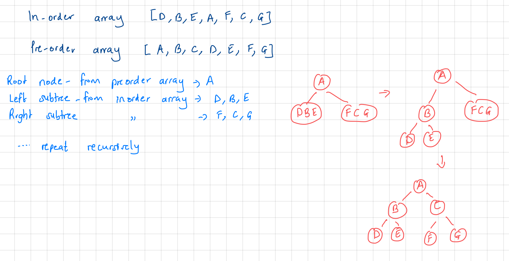

# Comprehensive Algorithms and Data Structures.

This repository houses my solutions and detailed explanations to popular algorithms and data structures problems. The solutions are provided in `JavaScript` / `TypeScript`, `Python`, `C` and `Java` which are languages that I am more comfortable with. The repo is intended to be my online reference or notes as I learn these topics and I hope you find this information valuable.

*Each algorithm and data structure has its own separate directory containing its implemetation and problem solutions in the various languages*


```sh
├── README.md
├── Algorithms
├────  sorting-algorithms/
├───────  insertion-sort/
│          ├── JavaScript/
│          ├── .../
├────  search-algorithms/
├───────  binary-search/
│          ├── JavaScript/
│          ├── .../
├── Data Structures
├────  trees/
├───────  binary-trees/
│          ├── JavaScript/
│          ├── ...
├── Leetcode
├────  1-two-sum/
│        ├── ...
```

## Table of Contents
- [Algorithms](#algorithms)
  - [Sorting Algorithms](#sorting-algorithms)
    - [Insertion Sort](#insertion-sort)
  - [Search Algorithms](#search-algorithms)
    - [Binary Search](#binary-search)
- [Data Structures](#data-structures)
  - [Trees](#trees)
    - [Binary Trees](#binary-trees)
    - [Binary Search Trees](#binary-search-trees)

  ---

# Algorithms

## Sorting algorithms

### Insertion Sort

Insertion sort builds the final sorted array, one element at a time by shifting elements to the right until the correct position in the sorted portion of the array is found. An intuitive way that I have seen it being described is it is like sorting a hand of playing cards - take a card, find its correct place within sorted cards, and insert it at that location.

**Algorithm**

Initialization
- Assuming we have an unsorted array of numbers: `[9,3,5,1,7,2,8,4]`
- We take the first element and consider it as the sorted portion of the array. `[9]`

Iteration
- Iterate over the remaining elements in the array starting from the second element `i=1`
- In each iteration, compare the current element with the sorted portion of the array, moving elements to the right until we find the correct position to insert the current element `array[i]`

Insertion
- For our example, consider the first element outside the sorted portion, `array[i]=3`
- Compare `3` with the elements in the sorted portion `[9]`
- `3` is smaller than `9` so move `9` one position to the right resulting in `[3,9]` as the current sorted portion of the array

Repeat until the array is sorted
- continue for all the remaining unsorted elements, comparing and shifting as necessary
- Once we reach the end of the array, it will be fully sorted

**Implementation**

`Javascript`

```js
function insertionSort(array) {
  for (let i = 1; i < array.length; i++) {
    const currVal = array[i];

    let j = i - 1;
    while (j >= 0 && array[j] > currVal) {
      array[j + 1] = array[j];
      j -= 1;
    }

    array[j + 1] = currVal;
  }
  return array;
}

const arr = [9, 3, 5, 1, 7, 2, 8, 4];

// [ 1, 2, 3, 4, 5, 7, 8, 9]
console.log(insertionSort(arr));
```

Other implementations: [`Python`](https://github.com/mathewbushuru/algorithms/blob/main/algorithms/sorting-algorithms/insertion-sort/python/insertion_sort.py), [`Java`](https://github.com/mathewbushuru/algorithms/blob/main/algorithms/sorting-algorithms/insertion-sort/java/insertionSort.java), [`C`](https://github.com/mathewbushuru/algorithms/blob/main/algorithms/sorting-algorithms/insertion-sort/c/insertion_sort.c), [`TypeScript`](https://github.com/mathewbushuru/algorithms/blob/main/algorithms/sorting-algorithms/insertion-sort/typescript/insertionSort.ts)

Time Complexity:
- Best case: `O(n)`
- Average and Worst case:  `(O(n^2))`

Space Complexity: O(1)

**Leetcode 147 (Medium) - [Insertion Sort List](https://leetcode.com/problems/insertion-sort-list/)**
> Given the `head` of a singly-linked linked list, sort the list using insertion sort, and return the sorted list's head.

> The steps of the insertion sort algorithm:
Insertion sort iterates, consuming one element each repetition and growing a sorted output list. At each iteration, insertion sort removes one element from the input data, finds the location it belongs in the input data and inserts it there.
It repeats until no input elements remain.

>Input: `head = [4,2,1,3]`
Output: `[1,2,3,4]`

>Input: `head = [-1,5,3,4,0]`
Output: `[-1,0,3,4,5]`

Solution


`JavaScript`

```js
// provided in problem
function ListNode(val, next) {
  this.val = val === undefined ? 0 : val;
  this.next = next === undefined ? null : next;
}

const insertionSortList = function (head) {
  // special case
  if (head === null) {
    return null;
  }

  // start of sorted list
  let dummyHead = new ListNode(0);
  dummyHead.next = head;

  // last node in sorted portion of list
  let lastSorted = head;

  // node to be inserted in iteration
  let curr = head.next;

  while (curr !== null) {
    if (lastSorted.val <= curr.val) {
      // curr in correct position already so just move pointer
      lastSorted = lastSorted.next;
    } else {
      // find correct position to insert curr
      let prev = dummyHead;

      while (prev.next.val <= curr.val) {
        prev = prev.next;
      }

      // insert curr just where prev stopped
      lastSorted.next = curr.next;
      curr.next = prev.next;
      prev.next = curr;
    }

    curr = lastSorted.next;
  }

  return dummyHead.next;
};
```

Other solutions: [`Python`](https://github.com/mathewbushuru/algorithms/blob/main/leetcode/147-insertion-sort-list-M/python/insertion_sort_list.py),  [`C`](https://github.com/mathewbushuru/algorithms/blob/main/leetcode/147-insertion-sort-list-M/c/insertionSortList.c), [`Java`](https://github.com/mathewbushuru/algorithms/blob/main/leetcode/147-insertion-sort-list-M/java/Solution.java), [`TypeScript`](https://github.com/mathewbushuru/algorithms/blob/main/leetcode/147-insertion-sort-list-M/typescript/insertionSortList.ts)

Time complexity: `O(n^2)`

Space complexity: `O(1)`

**Leetcode 57 (Medium) - [Insert Interval](https://leetcode.com/problems/insert-interval/)**

> You are given an array of non-overlapping intervals `intervals` where `intervals[i] = [starti, endi]` represent the start and the end of the `ith` interval and `intervals` is sorted in ascending order by `starti`. You are also given an interval `newInterval = [start, end]` that represents the start and end of another interval.

>Insert `newInterval` into `intervals` such that `intervals` is still sorted in ascending order by `starti` and `intervals` still does not have any overlapping intervals (merge overlapping intervals if necessary)

> Return `intervals` after the insertion.

> Input: `intervals = [[1,3],[6,9]]`, `newInterval = [2,5]`
Output: `[[1,5],[6,9]]`

>Input: `intervals = [[1,2],[3,5],[6,7],[8,10],[12,16]]`, `newInterval = [4,8]`
Output: `[[1,2],[3,10],[12,16]]`
Explanation: `Because the new interval [4,8] overlaps with [3,5],[6,7],[8,10]`.

Solution 

`JavaScript`

```js
var insert = function (intervals, newInterval) {
  const mergedIntervals = [];
  let i = 0;

  // iterate through  each interval
  while (i < intervals.length) {
    if (intervals[i][1] < newInterval[0]) {
      // current interval ends before newInterval starts (to its left)
      mergedIntervals.push(intervals[i]);
    } else if (intervals[i][0] > newInterval[1]) {
      // current interval starts after newInterval ends ( to its right)
      break;
    } else {
      // current interval overlaps with newInterval
      newInterval[0] = Math.min(intervals[i][0], newInterval[0]);
      newInterval[1] = Math.max(intervals[i][1], newInterval[1]);
    }

    i += 1;
  }

  // Insert new (possibly merged) interval
  mergedIntervals.push(newInterval);

  // insert remaining intervals
  while (i < intervals.length) {
    mergedIntervals.push(intervals[i]);
    i += 1;
  }

  return mergedIntervals;
};

// [ [ 1, 5 ], [ 6, 9 ] ]
console.log(insert([[1, 3],[6, 9]],[2, 5]));

// [ [ 1, 2 ], [ 3, 10 ], [ 12, 16 ] ]
console.log(insert([[1,2],[3,5],[6,7],[8,10],[12,16]],[4,8]))
```

Time complexity: `O(n)` where `n` is the number of intervals. We visit each interval at most once and do a constant amount of work each visit.

Space complexity: `O(n)`

## Search Algorithms

### Binary Search

Binary search is a divide and conquer algorithm used to efficiently search for a specific element in a sorted array. It works by repeatedly dividing the search space in half, eliminating the half that cannot contain the target element.

**Implementation**

`JavaScript`

```js
function binarySearch(array, target) {
  // lowest index of search space
  let low = 0;
  // highest index of search space
  let high = array.length - 1;

  while (low <= high) {
    // find the middle index
    let mid = Math.floor((low + high) / 2);

    if (array[mid] === target) {
      // target element found at middle index
      return mid;
    } else if (array[mid] < target) {
      // update lower bound to search in right half
      low = mid + 1;
    } else {
      // update upper bound to search in lower half
      high = mid - 1;
    }
  }

  // if we reach here, target was not found
  return -1;
}

const arr = [1, 2, 3, 4, 5, 6, 7, 8];

// 3
console.log(binarySearch(arr, 4));

```

Other implementations: [`C`](https://github.com/mathewbushuru/algorithms/blob/main/algorithms/binary-search/c/binarySearch.c), [`Java`](https://github.com/mathewbushuru/algorithms/blob/main/algorithms/binary-search/java/BinarySearch.java), [`Python`](https://github.com/mathewbushuru/algorithms/blob/main/algorithms/binary-search/python/binarySearch.py), [`TypeScript`](https://github.com/mathewbushuru/algorithms/blob/main/algorithms/binary-search/typescript/binarySearch.ts)

Time complexity: `O(log(n))`

Space complexity: `O(1)`

We can also use recursion for a more elegant solution but a worse space complexity.

```js
function binarySearchRecursive(array, target) {
  return binarySearchRecursiveHelper(array, target, 0, array.length - 1);
}

function binarySearchRecursiveHelper(array, target, low, high) {
  if (low > high) {
    // target element not found
    return -1;
  }

  // find middle index
  let mid = Math.floor((low + high) / 2);

  if (array[mid] === target) {
    // target element found at middle index
    return mid;
  } else if (array[mid] < target) {
    // search in right half
    return binarySearchRecursiveHelper(array, target, mid + 1, high);
  } else {
    // search in left half
    return binarySearchRecursiveHelper(array, target, low, mid - 1);
  }
}

const arr = [1, 2, 3, 4, 5, 6, 7, 8];

// 5
console.log(binarySearchRecursive(arr, 6));
```

Time complexity: `O(log(n))`

Space complexity: `O(log(n))`. Each recursive call adds a new frame to the call stack containing the local variables and parameters of each function call. The depth of the recursive calls corresponds to the number of times the search space is halved until the base case is reached.

**Leetcode 34 (Medium) - [Find First and Last Position of Element in Sorted Array](https://leetcode.com/problems/find-first-and-last-position-of-element-in-sorted-array/)**

> Given an array of integers nums sorted in non-decreasing order, find the starting and ending position of a given target value.

> If target is not found in the array, return [-1, -1]. You must write an algorithm with O(log n) runtime complexity.

> Input: `nums = [5,7,7,8,8,10]`, `target = 8`
Output: `[3,4]`

>Input: `nums = [5,7,7,8,8,10]`, `target = 6`
Output: `[-1,-1]`

> Input: `nums = []`, `target = 0`
Output: `[-1,-1]`

Algorithm: Use binary search due to the requirement of `O(log(n))` complexity and since the array is already sorted.

Solution

<!--  -->

`JavaScript`

```js
var searchRange = function (nums, target) {
  const result = [-1, -1];

  //binary search to find first index
  let start = 0;
  let end = nums.length - 1;

  while (start <= end) {
    let mid = Math.floor((start + end) / 2);
    if (nums[mid] >= target) {
      end = mid - 1;
    } else {
      start = mid + 1;
    }
  }

  //  found start index, check if it actually exists in nums
  if (nums[start] !== target) {
    return result;
  }

  result[0] = start;

  // binary search 2 to find end index
  end = nums.length - 1;

  while (start <= end) {
    let mid = Math.floor((start + end) / 2);
    if (nums[mid] <= target) {
      start = mid + 1;
    } else {
      end = mid - 1;
    }
  }

  result[1] = end

  return result
};

// [3,4]
console.log(searchRange([5, 7, 7, 8, 8, 10], 8));
```

Time complexity: `O(log(n))`

Space complexity: `O(1)`

**Leetcode 69 (Easy) - [Sqrt(x)](https://leetcode.com/problems/sqrtx/)**

> Given a non-negative integer x, return the square root of x rounded down to the nearest integer. The returned integer should be non-negative as well.

> You must not use any built-in exponent function or operator. For example, do not use `pow(x, 0.5)` in c++ or `x ** 0.5` in python

> Input: `x = 4`
Output: `2`
Explanation: `The square root of 4 is 2, so we return 2.`

> Input: `x = 8`
Output: `2`
Explanation: `The square root of 8 is 2.82842..., and since we round it down to the nearest integer, 2 is returned.`

Algorithm: Use binary search to find, the largest int `mid` such that  `mid * mid <= x`

Solution

<!--  -->

`JavaScript`

```js
var mySqrt = function (x) {
  if (x === 0) {
    return 0;
  }

  let left = 1;
  // sqrt(x) cannot be bigger than x/2 for any int x
  let right = Math.floor(x / 2) + 1;

  while (left <= right) {
    const mid = Math.floor((left + right) / 2);
    const square = mid * mid;

    if (square === x) {
      return mid;
    } else if (square < x) {
      left = mid + 1;
    } else {
      right = mid - 1;
    }
  }

  // exited loop without finding  exact square root
  // right  pointer holds floor value of square root
  return right;
};

// 2
console.log(mySqrt(4));

// 2
console.log(mySqrt(8));
```

Time complexity: `O(log(x))`

Space complexity: `O(1)`

**Leetcode 153 (Medium) - [Find Minimum in Rotated Sorted Array](https://leetcode.com/problems/find-minimum-in-rotated-sorted-array/)**

> Suppose an array of length n sorted in ascending order is rotated between 1 and n times. For example, the array `nums = [0,1,2,4,5,6,7]` might become:

>`[4,5,6,7,0,1,2]` if it was rotated 4 times.
`[0,1,2,4,5,6,7]` if it was rotated 7 times.

>Notice that rotating an array `[a[0], a[1], a[2], ..., a[n-1]]` 1 time results in the array `[a[n-1], a[0], a[1], a[2], ..., a[n-2]]`.

>Given the sorted rotated array `nums` of unique elements, return the minimum element of this array. You must write an algorithm that runs in `O(log n)` time.

> Input: `nums = [3,4,5,1,2]`
Output: `1`
Explanation: `The original array was [1,2,3,4,5] rotated 3 times`.

> Input: `nums = [4,5,6,7,0,1,2]`
Output: `0`
Explanation: `The original array was [0,1,2,4,5,6,7] and it was rotated 4 times.`

> Input: `nums = [11,13,15,17]`
Output: `11`
Explanation: `The original array was [11,13,15,17] and it was rotated 4 times. `

Algorithm: Use binary search to locate the pivot point of the rotated array. Since `nums` is rotated from a sorted array, the number next to the pivot is the minimum

Solution

<!--  -->

`JavaScript`

```js
var findMin = function (nums) {
  let left = 0;
  let right = nums.length - 1;

  while (left < right) {
    let mid = Math.floor((left + right) / 2);

    if (nums[mid] > nums[right]) {
      // right half not sorted, so pivot in right
      left = mid + 1;
    } else {
      // right half sorted, so pivot (and min number) in left half, including mid
      right = mid;
    }
  }

  // at end of loop, left == right, at index of min number
  return nums[left];
};

const nums1 = [3, 4, 5, 1, 2];
// 1
console.log(findMin(nums1));
```

Time complexity: `O(log(n))`

**Leetcode 704 (Easy) - [Binary Search](https://leetcode.com/problems/binary-search/)**

> Given an array of integers `nums` which is sorted in ascending order, and an integer `target`, write a function to search `target` in `nums`. If `target` exists, then return its index. Otherwise, return `-1`.

> You must write an algorithm with `O(log n)` runtime complexity.

> Input: `nums = [-1,0,3,5,9,12]`, `target = 9`
Output: `4`
Explanation: `9 exists in nums and its index is 4`

Solution

`JavaScript`

```js
var search = function (nums, target) {
  let left = 0;
  let right = nums.length - 1;

  while (left <= right) {
    let mid = Math.floor((left + right) / 2);

    if (nums[mid] === target) {
      return mid;
    } else if (nums[mid] < target) {
      left = mid + 1;
    } else {
      right = mid - 1;
    }
  }

  return -1;
};
```

Time complexity: `O(log(n))`

**Leetcode 875 (Medium) - [Koko Eating Bananas](https://leetcode.com/problems/koko-eating-bananas/)**

> Koko loves to eat bananas. There are `n` piles of bananas, the `i-th` pile has `piles[i]` bananas. The guards have gone and will come back in  `h` hours.

> Koko can decide her bananas-per-hour eating speed of `k`. Each hour, she chooses some pile of bananas and eats `k` bananas from that pile. If the pile has less than `k` bananas, she eats all of them instead and will not eat any more bananas during this hour.

> Koko likes to eat slowly but still wants to finish eating all the bananas before the guards return.

> Return the minimum integer `k` such that she can eat all the bananas within `h` hours.

> Input: `piles = [3,6,7,11]`, `h = 8`
Output: `4`

> Input: `piles = [30,11,23,4,20]`, `h = 5`
Output: `30`

> Input: `piles = [30,11,23,4,20]`, `h = 6`
Output: `23`

Algorithm: Use binary search to find the minimum possible `k` within the search space. We know that the minimum value of `k` is `1` and the maximum is `max(piles)`, so we search for it in this range.

Solution

`JavaScript`

```js
var minEatingSpeed = function (piles, h) {
  let left = 1;
  let right = Math.max(...piles);

  while (left <= right) {
    const mid = Math.floor((left + right) / 2);
    let hours = 0;

    for (let i = 0; i < piles.length; i++) {
      hours += Math.ceil(piles[i] / mid);
    }

    if (hours <= h) {
      // Koko can eat slower
      right = mid - 1;
    } else {
      left = mid + 1;
    }
  }

  return left;
};

const piles1 = [3, 6, 7, 11];
let h1 = 8;
// 4
console.log(minEatingSpeed(piles1, h1));
```

Time complexity: `O(nlog(n))` where n is max pile size.

---

# Data Structures

## Trees

A tree is a hierarchical data structure that represents a collection of elements called nodes. The nodes are connected by edges to form a tree-like structure. They enable efficient organization and retrieval of data.

The root is a special node that serves as the top-most node in a hierarchy. Each node in the tree, except for the root, has exactly one parent node and zero or more child nodes. Nodes directly connected to a particular node are called its children, and the node that connects to its children is called the parent.

### Binary Trees

This is a tree in which each node has at most two children, referred to as the left child and the right child. Each child node is either a leaf node (having no children) or an internal node (having one or more children). 

A complete binary tree is one in which each level of the tree is completely filled except the last level, and all nodes appear as far left as possible . A full/extended binary tree is one where no node has only one child - each node has either zero or two children. A perfect binary tree is both full and complete.

Binary tree traversal is the process of visiting each node in the tree exactly once. Three common methods of traversing binary trees are in-order traversal, pre-order traversal, and post-order traversal.

- In-order: Nodes are visited in the order 'left subtree' - 'parent node' - 'right subtree'. The left node is visited first, followed by the parent node, then the right child. This is used in binary search trees because it visits the nodes in ascending order if the tree is structured properly.
- Pre-order: Nodes are visited in the order 'parent node' - 'left subtree' - 'right subtree'. The parent node is visited before its children. It is useful for creating a copy of the tree, as the order of visiting the nodes allows for easy replication of the structure.
- Post-order: Nodes are visited in the order 'left subtree' - 'right subtree' - 'parent node'. The children are visited before the parent node. This is used in deleting nodes as it ensures the node is only deleted after its children have been deleted.


Note that trees can also be traversed in level-order (breadth-first algorithm.)

We can reconstruct a binary tree if given at least two traversal results. First traversal must be the in-order result, and the second can be either pre-order or post-order traversal. The in-order traversal helps us identify left and right child nodes, and the pre/post-order determines the root node. First element in pre-order traversal is the root node, while the last in post-order is the root node.

For example, if we are given two arrays with the preorder and inorder traversal results, we use the preorder array to find the root node (first element in array). We then locate the index of this root node in the inorder traversal array. Elements to the left of the root in the inorder array are from the left subtree. Similarly, those to the right of the root node form the right subtree. We recursively select elements from the preorder array and create its left and right subtrees from the inorder array.



**Implementation** 

`JavaScript`

```js
class Node {
  constructor(value) {
    this.value = value;
    this.left = null;
    this.right = null;
  }
}

class BinaryTree {
  constructor() {
    this.root = null;
  }

  insert(value) {
    const newNode = new Node(value);

    if (this.root === null) {
      this.root = newNode;
    } else {
      this.insertNode(this.root, newNode);
    }
  }

  insertNode(node, newNode) {
    if (newNode.value < node.value) {
      // if tree required to be a binary search tree, then smaller values to left subtree
      if (node.left === null) {
        node.left = newNode;
      } else {
        this.insertNode(node.left, newNode);
      }
    } else {
      // newNode is larger, insert in right subtree
      if (node.right === null) {
        node.right = newNode;
      } else {
        this.insertNode(node.right, newNode);
      }
    }
  }

  delete(value) {
    this.root = this.deleteNode(this.root, value);
  }

  deleteNode(node, value) {
    if (node === null) {
      return null;
    }

    if (value < node.value) {
      node.left = this.deleteNode(node.left, value);
    } else if (value > node.value) {
      node.right = this.deleteNode(node.right, value);
    } else {
      // delete current node
      if (node.left === null && node.right === null) {
        // has no children
        node = null;
      } else if (node.left === null) {
        //has one right child
        node = node.right;
      } else if (node.right === null) {
        // has one left child
        node = node.left;
      } else {
        // has two children
        const minRight = this.findMinNode(node.right);
        // minRight is larger than all left subtree values
        // and ofc smaller than all right subtree values
        // alternative would be to use max value in left subtree
        node.value = minRight.value;
        node.right = this.deleteNode(node.right, minRight.value);
      }
    }
    return node;
  }

  findMinNode(node) {
    if (node.left === null) {
      // nothing in left subtree, so parent is automatically the min
      return node;
    } else {
      return this.findMinNode(node.left);
    }
  }

  inOrderTraversal(callbackFn) {
    this.inOrderTraversalNode(this.root, callbackFn);
  }

  inOrderTraversalNode(node, callbackFn) {
    if (node !== null) {
      this.inOrderTraversalNode(node.left, callbackFn);
      callbackFn(node.value);
      this.inOrderTraversalNode(node.right, callbackFn);
    }
  }

  preOrderTraversal(callbackFn) {
    this.preOrderTraversalNode(this.root, callbackFn);
  }

  preOrderTraversalNode(node, callbackFn) {
    if (node !== null) {
      callbackFn(node.value);
      this.preOrderTraversalNode(node.left, callbackFn);
      this.preOrderTraversalNode(node.right, callbackFn);
    }
  }

  postOrderTraversal(callbackFn) {
    this.postOrderTraversalNode(this.root, callbackFn);
  }

  postOrderTraversalNode(node, callbackFn) {
    if (node !== null) {
      this.postOrderTraversalNode(node.left, callbackFn);
      this.postOrderTraversalNode(node.right, callbackFn);
      callbackFn(node.value);
    }
  }
}
```

Other implementations: [`TypeScript`](https://github.com/mathewbushuru/algorithms/blob/main/data-structures/binary-tree/typescript/binaryTree.ts), [`Java`](https://github.com/mathewbushuru/algorithms/blob/main/data-structures/binary-tree/java/BinaryTreeTestdrive.java), [`C - most challenging so far`](https://github.com/mathewbushuru/algorithms/blob/main/data-structures/binary-tree/c/binaryTree.c),[`Python`](https://github.com/mathewbushuru/algorithms/blob/main/data-structures/binary-tree/python/binaryTree.py)

An example binary tree (BST) is shown below


```js
const binaryTree = new BinaryTree();

binaryTree.insert(8);
binaryTree.insert(3);
binaryTree.insert(10);
binaryTree.insert(1);
binaryTree.insert(6);
binaryTree.insert(14);
binaryTree.insert(4);
binaryTree.insert(7);
binaryTree.insert(13);

console.log("In order traversal");
// 1 3 4 6 7 8 10 13 14
binaryTree.inOrderTraversal((value) => console.log(value));
console.log("---");

console.log("Pre order traversal");
// 8 3 1 6 4 7 10 14 13
binaryTree.preOrderTraversal((value) => console.log(value));
console.log("---");

console.log("Post order traversal");
// 1 4 7 6 3 13 14 10 8
binaryTree.postOrderTraversal((value) => console.log(value));
console.log("---");

binaryTree.delete(6);

console.log("In order traversal after deleting 6");
// 1 3 4 7 8 10 13 14
binaryTree.inOrderTraversal((value) => console.log(value));
console.log("---");
```

The complexities of this implementation are:

1. Node insertion

- The average and worst time complexity of inserting a node in a binary tree in `O(log(n))` for balanced trees and `O(n)` for skewed trees. Each insertion in a balanced binary tree reduces search space by half, while it may require traversing through all the nodes in a skewed tree.
- The space complexity is `O(1)` as we are not using any data structures that grow the size of the tree.

2. Node deletion

- The average and worst time complexity if `O(log(n))` for balanced trees and `O(n)` for skewed trees.

3. Traversal operations

- In-order, pre-order and post-order traversals visit each node in the binary tree once. 
- The time complexity is `O(n)` where n is the number of nodes in the tree.
- The space complexity is `O(h)` where h is the height of the tree. The recursive calls for traversing the tree occupies space in the call stack, and the maximum depth of the recursive call corresponds to the height of the tree. For a skewed tree, the space complexity degrades to `O(n)`

**Leetcode 101 (Easy) - [Symmetric Tree](https://leetcode.com/problems/symmetric-tree/)** 

> Given the `root` of a binary tree, check whether it is a mirror of itself (i.e., symmetric around its center).

> Input: `root = [1,2,2,3,4,4,3]`
Output: `true`

> Input: `root = [1,2,2,null,3,null,3]`
Output: `false`

Solution


`JavaScript`

```js
var isSymmetric = function (root) {
  return isMirror(root.left, root.right);
};

function isMirror(tree1, tree2) {
  if (tree1 === null && tree2 === null) {
    // base case - recursively traversed each tree and found no asymmetric case
    return true;
  }

  if (tree1 === null || tree2 === null) {
    // tree cannot be symmetric if node is only on one side
    return false;
  }

  // If these special cases do not apply, tree is symmetric if it fits three conditions

  let result =
    tree1.val === tree2.val && //current level of nodes equal
    isMirror(tree1.left, tree2.right) && // left of subtree1 equal to right of subtree2
    isMirror(tree1.right, tree2.left); // right of subtree1 equal to left of subtree2

  return result;
}
```

Time complexity: `O(n)` We visit each node in the tree.

Space complexity: `O(h)` = `O(log(n))` for the average case. In worst case, the depth of recursion can be upto number of nodes for a skewed tree - `O(n)`

**Leetcode 102 (Medium) - [Binary Tree Level Order Traversal](https://leetcode.com/problems/binary-tree-level-order-traversal/)**

> Given the `root` of a binary tree, return the level order traversal of its nodes' values. (i.e., from left to right, level by level).

> Input: `root = [3,9,20,null,null,15,7]`
Output: `[[3],[9,20],[15,7]]`

> Input: `root = [1]`
Output: `[[1]]`

> Input: `root = []`
Output: `[]` 

Algorithm: Use Breadth-First Search (BFS) to traverse the binary tree level by level

Solution

`JavaScript`

```js
var levelOrder = function (root) {
  // special case - empty tree, return empty array
  if (!root) {
    return [];
  }

  // array to store final output;
  const result = [];

  // array to hold nodes that we need to visit, initially with only root
  const queue = [root];

  // iterate as long as there are nodes in queue to be processed
  while (queue.length > 0) {
    // array to hold nodes in current level of tree
    const level = [];

    const length = queue.length;

    for (let i = 0; i < length; i++) {
      // process first element in queue
      let node = queue.shift();
      level.push(node.val);

      // if node has children, add them to end of list so we can look at them later
      if (node.left) {
        queue.push(node.left);
      }
      if (node.right){
        queue.push(node.right);
      }
    }

    result.push(level);
  }

  return result;
};
```

Time complexity: `O(n)`, each node is processed exactly once. 

Space complexity: `O(n)`, in worst case scenario, tree holds all leaf (last-level) nodes. For a complete BT, the last level holds `n/2` nodes and `O(n/2)` = `O(n)`

**Leetcode 104 (Easy) - [Maximum Depth of Binary Tree](https://leetcode.com/problems/maximum-depth-of-binary-tree/)**

> Given the `root` of a binary tree, return its maximum depth. 

> A binary tree's maximum depth is the number of nodes along the longest path from the root node down to the farthest leaf node. 

> Input: `root = [3,9,20,null,null,15,7]`
Output: `3`

>Input: `root = [1,null,2]`
Output: `2`

Solution

`JavaScript`

```js
function TreeNode(val, left, right) {
  this.val = val === undefined ? 0 : val;
  this.left = left === undefined ? null : left;
  this.right = right === undefined ? null : right;
}

var maxDepth = function (root) {
  if (root === null) {
    return 0;
  } else {
    let leftDepth = maxDepth(root.left);
    let rightDepth = maxDepth(root.right);
    return Math.max(leftDepth, rightDepth) + 1;
  }
};
```

Time complexity: `O(n)` where n is total number of nodes. We visit every node once due having recursive calls to both the left and right subtrees. 

Space complexity: `O(h)` where h is the height of the tree. The maximum depth of the recursive call is the height of the tree.

**Leetcode 105 (Medium) - [ Construct Binary Tree from Preorder and Inorder Traversal
](https://leetcode.com/problems/construct-binary-tree-from-preorder-and-inorder-traversal/)**

> Given two integer arrays `preorder` and `inorder` where `preorder` is the preorder traversal of a binary tree and `inorder` is the inorder traversal of the same tree, construct and return the binary tree.

> Input: `preorder = [3,9,20,15,7]`, `inorder = [9,3,15,20,7]`
Output: `[3,9,20,null,null,15,7]`

> Input: `preorder = [-1]`, `inorder = [-1]`
Output: `[-1]`

Solution

`JavaScript`

```js
// provided in problem
function TreeNode(val, left, right) {
  this.val = val === undefined ? 0 : val;
  this.left = left === undefined ? null : left;
  this.right = right === undefined ? null : right;
}

var buildTree = function (preorder, inorder) {
  // we search for root element in inorder arrays several times
  // so we turn it into a map for O(1) search instead of the slower O(n) array search
  // using array.indexOf(rootValue) would be O(n)
  const map = new Map();
  inorder.forEach((value, index) => {
    map.set(value, index);
  });

  // helper function to construct the binary tree
  return buildTreeHelper(
    preorder,
    0,
    preorder.length - 1,
    inorder,
    0,
    inorder.length - 1,
    map
  );
};

function buildTreeHelper(
  preorder,
  preorderStart,
  preorderEnd,
  inorder,
  inorderStart,
  inorderEnd,
  map
) {
  // base case - no more nodes to process in current subtree
  if (preorderStart > preorderEnd) {
    return null;
  }

  const rootValue = preorder[preorderStart];
  const root = new TreeNode(rootValue);

  const inorderRootIndex = map.get(rootValue);
  const leftSubtreeSize = inorderRootIndex - inorderStart;

  // preorder array for left child between [preorderStart+1, preorderStart+leftSubtreeSize]
  // inorder array for left child between [inorderStart, inorderRootIndex-1]
  root.left = buildTreeHelper(
    preorder,
    preorderStart + 1,
    preorderStart + leftSubtreeSize,
    inorder,
    inorderStart,
    inorderRootIndex - 1,
    map
  );

  // preorder array for right child between [preorderStart+leftSubtreeSize+1, preorderEnd]
  // inorder array for right child between [inorderRootIndex+1, inorderEnd]
  root.right = buildTreeHelper(
    preorder,
    preorderStart + leftSubtreeSize + 1,
    preorderEnd,
    inorder,
    inorderRootIndex + 1,
    inorderEnd,
    map
  );

  return root;
}

```

Time complexity: `O(n)` We visit each node in the tree once to construct the binary tree

Space complexity: `O(n)` where n is number of nodes. We store the inorder array in a map for faster search of the root index. If we were to avoid using the map, we would have a worse time complexity but the space complexity would improve to `O(log(n))` which would account for the recursion stack

**Leetcode 112 (Easy) - [Path Sum](https://leetcode.com/problems/path-sum/)**

> Given the `root` of a binary tree and an integer `targetSum`, return `true` if the tree has a root-to-leaf path such that adding up all the values along the path equals `targetSum`.

> A leaf is a node with no children.

>  Input: `root = [5,4,8,11,null,13,4,7,2,null,null,null,1]`, `targetSum = 22`
Output: `true`
Explanation: `The root-to-leaf path with the target sum is 5->4->11->2.`

> Input: `root = [1,2,3]`, `targetSum = 5`
Output: `false`
Explanation: There two root-to-leaf paths in the tree:
(1 --> 2): The sum is 3.
(1 --> 3): The sum is 4.
There is no root-to-leaf path with sum = 5.

> Input: `root = []`, `targetSum = 0`
Output: `false`
Explanation: `Since the tree is empty, there are no root-to-leaf paths.`

Algorithm: Use a recursive approach. Traverse the tree in a depth-first manner, examining each node along the way. At each node, subtract the node's value from the target sum. Continue recursively checking left and right children until we reach a leaf node. If the leaf node's value is equal to the remaining sum, return true. Otherwise (or if we reach null), return false as we have reach the end of the tree without finding the target sum.

Solution

`JavaScript`

```js
// root - current node being checked recursively
// targetSum - resulting sum after recursively subtracting upper node values
var hasPathSum = function (root, targetSum) {
  // base case
  if (root === null) {
    return false;
  }

  // check if current node is leaf node
  if (root.left === null && root.right === null) {
    return root.val === targetSum;
  }

  // internal nodes
  // reduce sum, and recursively check left and right children
  return (
    hasPathSum(root.left, targetSum - root.val) ||
    hasPathSum(root.right, targetSum - root.val)
  );
};

```

Time complexity: `O(n)` - In the worst case, we might have to visit all the nodes in the tree

Space complexity: `O(h)` where h is the height of the tree. In worst case tree height can be equal to number of nodes in tree, `O(n)` (Completely unbalanced trees)

### Binary Search Trees

This is  a binary tree with  a special property: For every node, the value of each node in its left subtree is less than its value, and the value of each node in is right subtree is greater than its value.

---
