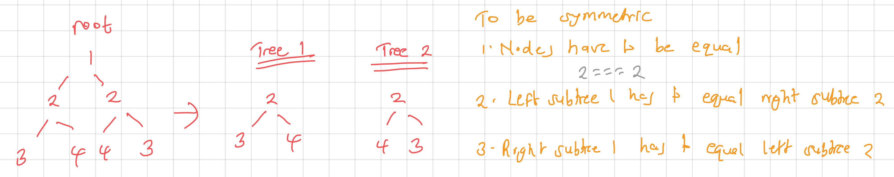

**Leetcode 101 (Easy) - [Symmetric Tree](https://leetcode.com/problems/symmetric-tree/)**

> Given the `root` of a binary tree, check whether it is a mirror of itself (i.e., symmetric around its center).

> Input: `root = [1,2,2,3,4,4,3]`
> Output: `true`

> Input: `root = [1,2,2,null,3,null,3]`
> Output: `false`

Solution



`JavaScript`

```js
var isSymmetric = function (root) {
  return isMirror(root.left, root.right);
};

function isMirror(tree1, tree2) {
  if (tree1 === null && tree2 === null) {
    // base case - recursively traversed each tree and found no asymmetric case
    return true;
  }

  if (tree1 === null || tree2 === null) {
    // tree cannot be symmetric if node is only on one side
    return false;
  }

  // If these special cases do not apply, tree is symmetric if it fits three conditions

  let result =
    tree1.val === tree2.val && //current level of nodes equal
    isMirror(tree1.left, tree2.right) && // left of subtree1 equal to right of subtree2
    isMirror(tree1.right, tree2.left); // right of subtree1 equal to left of subtree2

  return result;
}
```

Time complexity: `O(n)` We visit each node in the tree.

Space complexity: `O(h)` = `O(log(n))` for the average case. In worst case, the depth of recursion can be upto number of nodes for a skewed tree - `O(n)`
